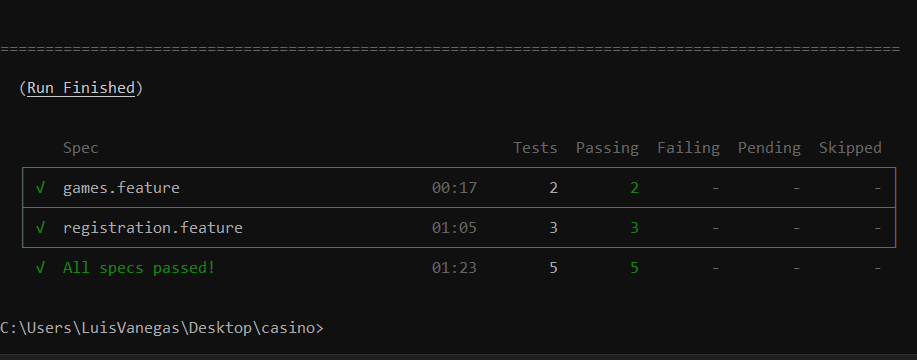
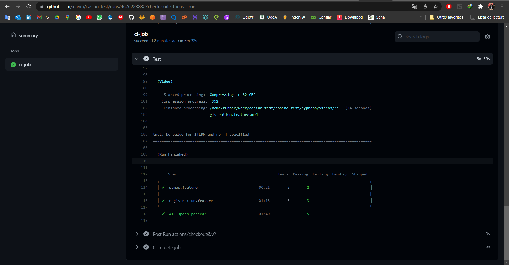

# Casino Demo - Automatización de prueba E2E

Se automatiza el registro de usuarios por email, por telefono y 2 características adicionales de la página https://demo.casino

--------------------------------------------------------------

## Implementación

Realizo un `Exploritory Testing` manual para tener más detalle de la APP, conocer los elementos del DOM con los que interactuaré y la tecnología que hay detrás de las funcionalidades.

Aplico todos los principios `SOLID` al usar el patron de diseño `Screenplay` para desarrollar unos scripts escalables y de fácil mantenimiento; (teniendo en cuenta que el desarrollo estaba hecho), aplico `BDD` para realizar la prueba E2E con base a principios de `Clean Code` y aplicando las `Best Practices` recomendadas por el framework utilizado `Cypress`.

Uso `Cucumber` para implementar el lenguaje `Gherkin` con el fin de tener una mayor aplicación del BDD y un mayor entendiemiento de los casos de pruebas que estoy implementando en la app.

en el folder `cypress/screenplay/` tego mapeadas todas las capas del patrón de diseño usado. 
* En `screen` ubico todos los campos u elementos del DOM para cada una de las vistas de la app. 
* En `tasks` tengo todas las acciones que ejecutará el robot para cada una de las vistas de la app. 
* En `Question` tengo todas las aserciones o resultados esperados por las acciones que se ejecuten en cada una de las vistas de la app

--------------------------------------------------------------

## Resolución de Test

3 casos de pruebas para el registro de un usuario
1. Caso en que el usuario se registra con email
2. Caso en que el usuario se registra por telefono
3. Caso en que el usuario ingresa un email incorrecto

2 casos de pruebas para la lista de juegos
1. Caso en que el usuario ingresa al menú "Games" y ve los juegos TOP
2. Caso en que el usuario ingresa al menú "Games" y ve los proveedores

### Resultado de ejecución



--------------------------------------------------------------

## CI - Test

Creo un archivo `ci.yml` dentro de la ruta: `.github/workflows` que contiene las instrucciones necesarias para llevar a cabo la ejecución de un pipeline de CI que se encarga de ejecutar los `Test` sí se hace un `push` o un `Pull Request` a la rama `Main` (Esto es orquestado por `Github Actions` de forma automatizada).

### Resultado de Ejecución



--------------------------------------------------------------

## Prerequisitos

- node js

--------------------------------------------------------------

## Ejecución Local del Proyecto
```
# instalar dependencias
npm install cypress

# ejecutar pruebas
npm start
```

--------------------------------------------------------------

## Errores Solucionados

### > The following error originated from your application code, not from Cypress. It was caused by an unhandled promise rejection.
### Solución: 

en el archivo: `support/index.js`

Incluyo el código: 
```js
import './commands'
Cypress.on('uncaught:exception', (err, runnable) => {
  // returning false here prevents Cypress from failing the test
  return false
})
```